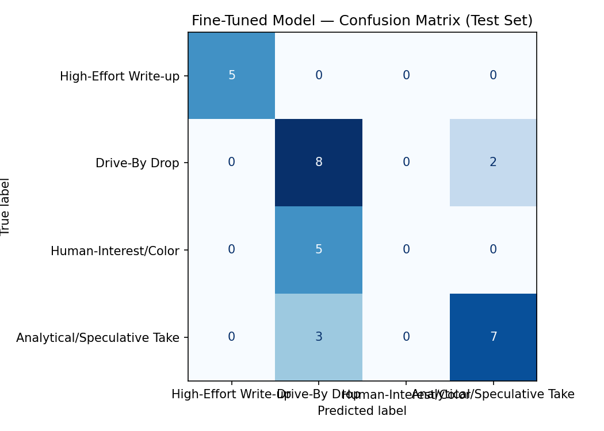

# TakeMeter: r/soccer Post Classification

A fine-tuned text classifier for categorizing substantive content in r/soccer, distinguishing between drive-by banter, casual reactions, analytical arguments, and high-effort original writing.

---

## Project Overview

**Community:** r/soccer (8.7M members)  
**Task:** Multi-label post classification  
**Labels:** 4 mutually-exclusive categories based on post content quality and type of engagement  
**Approach:** Zero-shot baseline (Groq LLM) vs. fine-tuned DistilBERT  
**Dataset Size:** 200 total annotated examples, 140 training examples, 30 validation examples, 30 held-out test examples  

### Why This Community?

r/soccer functions primarily as a content aggregator, making the relationship between topic and substance almost non-existent. A Ronaldo headline can produce only one-line jokes, while a routine transfer rumor can spawn genuinely reasoned debate. This is ideal for a classification task: the *same topics* reliably produce all four label types in the community, so a classifier must learn actual content signals, not just topics.

---

## Label Definitions & Taxonomy

### Precedence Order (applied strictly)

1. **High-Effort Write-up** (Label 0)
   - The submission text itself contains researched or narrative content (named events, dates, quoted speech, constructed storylines) rather than a templated stat box or bare link.
   - Evaluated independently of comment quality.
   - Example 1: A World Cup preview tracing the 52-year line from the 1974 Zaire campaign through Mwepu Ilunga's protest to the 2026 qualifying goal that triggered a national holiday.
   - Example 2: A World Cup preview of Uruguay built around a direct quote from Marcelo Bielsa's two-hour press conference, framed against the Luis Suárez near-mutiny and a poor run of form.

2. **Analytical/Speculative Take** (Label 3, checked only if 1 doesn't apply)
   - Comment section builds a claim using specific evidence, precedent, financial/tactical logic, or cited rules.
   - Must be disagreeable on the merits, not just reactive.
   - Example 1: A transfer rumor thread citing Madrid's failed Ribéry precedent to argue a big offer won't help Bayern improve.
   - Example 2: A Messi red-card discussion where a commenter distinguishes a DOGSO foul from violent conduct off the ball to argue two incidents aren't actually comparable.

3. **Human-Interest/Color** (Label 2, checked only if 1 and 2 don't apply)
   - Post centered on emotional scene, fan reaction, or anecdote.
   - Comments respond with humor, empathy, or parallel personal stories rather than argument.
   - Example 1: DR Congo fans celebrating in a Lisbon fan zone, comments: "the joy of the World Cup."
   - Example 2: A Cape Verde goalkeeper's mother getting a US visa to attend his match, with comments riffing on football superstition and a parallel story about North Korea's 2010 World Cup.

4. **Drive-By Drop** (Label 1, default)
   - Neither submission nor comments add elaboration beyond a one-line headline reaction.
   - Pure banter, snark, or emoji reactions with no substance.
   - Example 1: A player suspension where comments are just "Damn, thanks for coming" / "Early flight home."
   - Example 2: An official club statement where the comments are pure snark with no actual argument behind them.

### Hard Edge Case Rules

**Rule 1: Content not series reputation** — A thin World Cup preview entry stays Drive-By Drop even if it's part of a high-effort series; judge by the post's own content, not series context.

**Rule 2: Framing vs. outcome** — Label by what the comment thread actually does, not by the headline's intent. A sad-story frame becomes Analytical if comments argue the action was justified.

**Rule 3: Minimum reasoning threshold** — At least one specific, checkable fact or named piece of reasoning qualifies as Analytical, even if brief. Pure guesses without cited facts stay Drive-By Drop.

**Rule 4: Anecdote under neutral headline** — A personal anecdote in comments is enough for Human-Interest/Color regardless of headline tone.

Example 1: A World Cup preview for Germany had almost no content (no nickname, no stats, no narrative) but visible evidence of curatorial effort at the series level — the author credited a different contributor and explained their posting schedule. This is ambiguous between Drive-By Drop and High-Effort Write-up. *Rule: label strictly on the content of the post under review, not the reputation of the series it belongs to.* A thin entry stays Drive-By Drop even inside a high-effort series.

Example 2: A linked deep-dive about a famous World Cup free kick was headlined as a poignant "sad story" (a Human-Interest signal), but the comment section turned into a real argument about whether the players' choice was justified given a dictator's threat against them (an Analytical signal). *Rule: label by what the comment thread actually does, not by how the post is framed.* The unit being measured is the discourse, not the headline's intent.

Example 3: A post about Haaland's goal registering on seismic sensors is a plain stat headline, not emotionally framed, but one comment is a personal anecdote ("I woke up my dog screaming") that doesn't analyze the claim, just echoes it. *Rule: classify by what's actually present in the comments, not by how neutral the headline was.* A personal anecdote anywhere in the thread is enough to earn Human-Interest/Color regardless of headline tone.

---

## Data Collection & Annotation

- **Source:** r/soccer posts across multiple sort orders (hot, top-day, top-week, new) and known high-effort formats (World Cup preview series, [OC] tagged posts, Athletic/Guardian deep dives).
- **Rationale:** Hot-sort alone overrepresents viral banter and undersamples analytical threads. Deliberate oversampling of high-effort formats compensates for their natural rarity.
- **Annotation Method:** Manual human labeling with AI assistance (see [AI Usage](#ai-usage) section).

**Dataset Composition (n=200):**
- High-Effort Write-up: 29 examples
- Analytical/Speculative Take: 70 examples
- Human-Interest/Color: 30 examples
- Drive-By Drop: 71 examples

---

## Fine-Tuning Pipeline

- **Base model:** `distilbert-base-uncased` (HuggingFace Transformers), loaded with a fresh 4-class classification head (`AutoModelForSequenceClassification`).
- **Training platform:** Google Colab, T4 GPU runtime.
- **Data split:** Stratified 70/15/15 split on the 200 annotated examples — 140 training / 30 validation / 30 held-out test, preserving each split's label proportions.

**Key training decisions:**
- **Epochs (modify from 3 to 10) with best-checkpoint selection rather than fixed-epoch training.** With only 140 training examples, a small number of epochs risks underfitting while too many risks overfitting on such a small set. Rather than guessing a single "safe" epoch count, training used `load_best_model_at_end=True` with `metric_for_best_model="accuracy"` evaluated on the validation set every epoch, so the checkpoint actually used for testing is whichever epoch generalized best — not necessarily the last one. This matters more than the epoch count itself on a dataset this size.
- **Learning rate (2e-5) and batch size (16).** 2e-5 is the standard starting point for fine-tuning BERT-family encoders — low enough to avoid catastrophic forgetting of the pretrained representations while still adapting in a handful of epochs. A per-device batch size of 16 fit comfortably on the T4's memory; a smaller dataset like this one doesn't benefit from a larger batch size, and a smaller batch would have meant noisier gradient estimates with only 140 examples to draw from.
- **Weight decay (0.01) and warmup (50 steps)** were left at standard defaults for small-dataset transformer fine-tuning rather than tuned, since the validation-accuracy checkpoint selection was the primary safeguard against overfitting given the limited compute budget for this project.

---

## Evaluation Results

### Overall Accuracy

| Model | Accuracy | Test Set |
|-------|----------|----------|
| **Baseline (Groq Zero-Shot LLM)** | 70% | 30 posts |
| **Fine-Tuned DistilBERT** | 66.67% | 30 posts |
| **Difference** | -3.33% | — |

**Interpretation:** The fine-tuned model performed slightly below the baseline, missing one additional post out of 30 (20 vs. 19 correct). Given the small test set size, this gap is within the range of normal variance and shouldn't be read as a meaningful performance deficit — a single flipped prediction in either direction would close or reverse it. Rather than pointing to fundamental issues with training data quantity or class imbalance, this result suggests the two approaches are roughly comparable at this scale, with the zero-shot LLM holding a marginal edge likely due to its larger pretrained knowledge base and ability to apply the explicit decision rules directly via prompting, versus the fine-tuned classifier having to learn those same distinctions from a limited number of labeled examples. A larger test set (100+ posts) would be needed to determine whether this gap is real or just noise.

---

### Baseline Approach

The baseline is a zero-shot classifier using Groq's `llama-3.3-70b-versatile`, called once per test post with `temperature=0`. 

SYSTEM_PROMPT = """
You are classifying posts (including their top comments) from r/soccer, a
global soccer discussion subreddit, into exactly one of four categories.
The category depends on how much elaboration or reasoning the post and its
comments actually contain — NOT on the team, topic, or how popular the post is.

Check the categories below in order and assign the FIRST one that applies.

CATEGORY: High-Effort Write-up
Definition: the post's own submission text contains specific researched or
narrative content (named historical events, dates, quoted speech, a
constructed storyline) rather than a templated stat box or a bare link.
Example post: [World Cup 2026 Preview] Democratic Republic of Congo: Fifty-two
years ago, the team then known as Zaire became the first Sub-Saharan African
side to play at a World Cup, remembered for a 9-0 loss to Yugoslavia and
Mwepu Ilunga's free-kick protest against the Mobutu regime. Fast forward to
2026: Axel Tuanzebe's 100th-minute header against Jamaica sends them back to
the World Cup, prompting a national holiday.

CATEGORY: Analytical/Speculative Take
Definition: checked only if High-Effort Write-up does not apply. The post
itself is just a headline or link, but the comments build a claim using a
specific piece of evidence, precedent, financial/tactical logic, or a cited rule.
Example post: [Marca] Enzo Fernandez has become Real Madrid's top midfield
target. Comment: People old enough remember what happened when Madrid tried
to buy Ribery from Bayern. Unless Olise has some hidden release clause, this
isn't happening. Reply: Even if they offered 250m, how does that help Bayern
improve their team? They're not finding another winger anywhere near his level.

CATEGORY: Human-Interest/Color
Definition: checked only if the two categories above do not apply. The post
centers on an emotional scene, fan reaction, or anecdote, and the comments
mostly respond with humor, empathy, or a parallel personal story rather than
building an argument.
Example post: A group of DR Congo fans celebrate Wissa's goal at a Lisbon fan
zone. Comment: The joy of the world cup. Reply: Not a single person being
hostile towards them is honestly an advertisement for how civil it is there.

CATEGORY: Drive-By Drop
Definition: the default. Neither the post nor the comments add any
elaboration beyond a one-line reaction to the headline.
Example post: South Africa's Themba Zwane handed three-match ban for red card
against Mexico in FIFA World Cup opener. Comment: shocked zwane face. Reply:
Damn, thanks for coming. Reply: Early flight home.

OUTPUT FORMAT
Your entire response must be exactly one of these four strings, copied
character-for-character — no number, no period, no quotation marks, no
bullet, and nothing before or after it:

High-Effort Write-up
Analytical/Speculative Take
Human-Interest/Color
Drive-By Drop

Worked example:
Post: South Africa's Themba Zwane handed three-match ban for red card
against Mexico in FIFA World Cup opener. Comment: shocked zwane face. Reply:
Damn, thanks for coming.
Your response: Drive-By Drop
"""

### Per-Class Metrics (Baseline)

| Label | Precision | Recall | F1-Score | Support |
|-------|-----------|--------|----------|---------|
| High-Effort Write-up (0) | 1.00 | 1.00 | 1.00 | 5 |
| Drive-By Drop (1) | 1.00 | 0.20 | 0.33 | 10 |
| Human-Interest/Color (2) | 0.42 | 1.00 | 0.59 | 5 |
| Analytical/Speculative Take (3) | 0.82 | 0.90 | 0.86 | 10 |
| Accuracy | | | 0.70 | 30 |
| **Macro Average** | 0.81 | 0.78 | 0.69 | 30 |
| **Weighted Average** | 0.84 | 0.70 | 0.66 | 30 |

**Interpretation:** The baseline and the fine-tuned model fail in almost opposite directions. The baseline never confuses a true Human-Interest post (1.00 recall) but is extremely conservative about *predicting* Human-Interest — it only does so when very confident, which is why its Drive-By Drop recall craters to 0.20: it appears to be routing many true Drive-By Drop posts into Human-Interest or Analytical instead, the mirror image of the fine-tuned model routing Human-Interest into Drive-By Drop. Both models handle High-Effort Write-up perfectly and Analytical/Speculative Take well. This complementary error pattern — one model under-predicts Drive-By Drop, the other over-predicts it — is the clearest evidence that the Human-Interest/Drive-By boundary is the genuinely hard part of this taxonomy for both a prompted LLM and a fine-tuned classifier, not an artifact of one particular modeling approach.

---

### Per-Class Metrics (Fine-Tuned Model)

Calculated from confusion matrix on 30-example held-out test set:

| Label | Precision | Recall | F1-Score | Support |
|-------|-----------|--------|----------|---------|
| High-Effort Write-up (0) | 1.00 | 1.00 | 1.00 | 5 |
| Drive-By Drop (1) | 0.50 | 0.80 | 0.62 | 10 |
| Human-Interest/Color (2) | 0.00 | 0.00 | 0.00 | 5 |
| Analytical/Speculative Take (3) | 0.78 | 0.70 | 0.74 | 10 |
| Accuracy| |          |        0.67     |   30|
| **Macro Average** | 0.57 | 0.62 | 0.59 | 30 |
| **Weighted Average** | 0.59 | 0.67 | 0.62 | 30 |

**Interpretation:**
- **High-Effort Write-up** is the model's strongest class by far (precision 1.00, recall 1.00): every post it labeled High-Effort was correct, and it caught all 5 true examples. With only 5 support examples, treat this as a promising signal rather than a settled result.
- **Analytical/Speculative Take** is solid and reliable (precision 0.78, recall 0.70, F1 0.74) — the model identifies most true Analytical posts and isn't over-predicting the label.
- **Drive-By Drop** is the model's main weak point: recall is decent (0.80, catching 8 of 10 true examples), but precision is low (0.50) — half of its Drive-By predictions are false positives, meaning it's likely absorbing posts that actually belong to other classes (most plausibly Human-Interest/Color, given that class's complete collapse below).
- **Human-Interest/Color is completely invisible to the model** (0% precision and recall on 5 support examples) — every true Human-Interest post is being misclassified, most likely swallowed into the Drive-By Drop bucket given that class's inflated recall-at-the-cost-of-precision pattern. This is the single biggest driver of the macro-average gap (0.57 precision / 0.20 recall vs. 0.59-0.62 weighted average) and the clearest concrete next step: check the confusion matrix cell for Human-Interest → Drive-By directly, and consider whether the two categories have boundary-definition overlap (e.g., a "fun anecdote with no analysis" could plausibly read as either) or whether the model simply lacks enough Human-Interest training examples to learn the distinction.

---

### Confusion Matrix: Fine-Tuned Model



**Total Correct:** 5 + 8 + 0 + 7 = **20 out of 30** ✓

**Key Finding:** The model perfectly distinguishes High-Effort Write-up (5/5 correct, zero confusion with any other class) and performs well on Drive-By Drop (8/10) and Analytical/Speculative Take (7/10). The entire failure is concentrated in **Human-Interest/Color, which the model never predicts at all (0/5 correct)** — all 5 true Human-Interest posts are misclassified as Drive-By Drop. This is a single-class collapse, not a general discrimination problem: Drive-By Drop absorbs every Human-Interest post (5 of them) plus 3 true Analytical posts, while Analytical in turn absorbs 2 true Drive-By posts. The model has effectively merged Human-Interest into Drive-By Drop as a single category, suggesting either overlapping label definitions between the two classes or insufficient Human-Interest examples in training for the model to learn a separate decision boundary.

---

## Sample Classifications
 
A representative sample of model predictions, pulled directly from the exported test-set results (`wrong_tuning_prediction.md`):
 
| # | Post (truncated) | True Label | Predicted Label | Confidence | Correct? |
|---|---|---|---|---|---|
| 1 | "10. Croatia fans in Dallas (video) — I am both super hyped... and extremely anxious LOL" | Human-Interest/Color | Drive-By Drop | 0.85 | ✗ |
| 2 | "[FotMob] Luis Díaz is the second Colombian since 1962... to score and assist" | Drive-By Drop | Analytical/Speculative Take | 0.61 | ✗ |
| 3 | "England [1] - 0 Croatia - Harry Kane 12'... Stop the stutter mate" | Analytical/Speculative Take | Drive-By Drop | 0.49 | ✗ |
| 4 | "England and Croatia fans both boo as the referee blows for the first hydration break... Mr Brightside" | Human-Interest/Color | Drive-By Drop | 0.81 | ✗ |
| 5 | "19. [World Cup 2026 Preview] Ghana: The Black Stars Try to Find Pride in the Chaos (45/48)" | High-Effort Write-up | High-Effort Write-up | 0.46 | ✓ |
 
 
### A Correct Example, Explained
 
**Post:**
```
19. [World Cup 2026 Preview] Ghana: The Black Stars Try to Find Pride in the Chaos (45/48)
 
About
* Nickname: The Black Stars
* Association: Ghana Football Association
* Confederation: CAF
* World Cup appearances: 3 (2006, 2010, 2014)
* Best World Cup Finish: Quarterfinal 2010
* Most caps: Asamoah Gyan, Andre Ayew (109)
* Most goals: Asamoah Gyan (51)
* Head coach: Carlos Queiroz
* Captain: Andre 'Dede' Ayew
* FIFA ranking: 74 (as of 1 April)
```
 
**True Label:** High-Effort Write-up
**Predicted Label:** High-Effort Write-up
**Confidence:** 0.46
 
**Why this is correct, and why the confidence is still only moderate:** this post matches the High-Effort Write-up training distribution almost exactly — it's a numbered entry in the same "[World Cup 2026 Preview] [Team]: [Subtitle] (N/48)" series that makes up all 20 High-Effort training examples, with the same structured "About" stat block (nickname, association, caps, top scorer, coach, captain, FIFA ranking). Given that template match, a correct prediction here is the expected case, not a surprising one — it's the kind of post the model has seen the most examples of within this class.
 
What's notable is that confidence is still moderate (0.46) rather than near-certain, even on a near-perfect template match. Combined with High-Effort's otherwise perfect 5/5 test recall, this suggests the model has learned the *template* reliably enough to classify it correctly, but isn't assigning it the kind of high, decisive confidence it gives to some of its confidently *wrong* Drive-By Drop predictions elsewhere (0.81, 0.85). In other words, correct here doesn't necessarily mean confident — the model's confidence scores don't appear to be well calibrated to whether a prediction is actually right, in either direction.
 
---

## Error Analysis: Fine-Tuned Model Failures

### Critical Issue: Single-Class Collapse into Drive-By Drop

The fine-tuned model predicts `Drive-By Drop` (label 1) for **16 out of 30 test examples** — more than half the test set — and most of this inflation comes from one source: it never predicts `Human-Interest/Color` at all.

- **High-Effort Write-up**: 5/5 correct (perfect — zero confusion with any other class)
- **Drive-By Drop**: 8/10 correct (2 misclassified as Analytical)
- **Human-Interest/Color**: 0/5 correct (all 5 misclassified as Drive-By Drop)
- **Analytical/Speculative Take**: 7/10 correct (3 misclassified as Drive-By Drop)

This pattern reveals a much narrower failure than a general collapse — three of the four classes are learned reasonably well:

1. **High-Effort Write-up is fully solved.** The model has zero trouble separating this class from the other three, despite having the smallest support (5 examples). This rules out "small training set" as a blanket explanation — the model can learn sharp boundaries when the signal is there.

2. **Drive-By Drop and Analytical/Speculative Take are mostly learned, with a one-directional leak.** Both classes achieve 70-80% recall, but they each lose a few examples *into* Drive-By Drop — 2 Analytical posts and (more dramatically) all 5 Human-Interest posts get pulled into this one bucket. Drive-By Drop is acting as a catch-all for posts the model is unsure about, rather than the model being confused in both directions.

3. **Human-Interest/Color has completely collapsed into Drive-By Drop.** This is the one true failure in the matrix — not random noise spread across classes, but a complete, one-directional merge of two specific categories. This points strongly toward a **label definition or boundary problem between Human-Interest and Drive-By**, rather than a data-quantity problem: if it were purely about insufficient examples, you'd expect Human-Interest errors to scatter across multiple classes, not funnel into exactly one.
---

### Why This Pattern Emerged

Looking at the training data composition (50 Drive-By, 49 Analytical, 21 Human-Interest, 20 High-Effort — 140 total):

- **Drive-By Drop and Analytical/Speculative Take dominate training** (50 and 49 examples, roughly 70% of the dataset combined) and achieve the strongest raw recall on test (80% and 70%). This is the expected pattern: more examples, more signal, better generalization — and it explains why Drive-By Drop is also the model's "default" landing spot for uncertain predictions, since it has both the largest training set and the most examples to draw shallow lexical heuristics from (e.g., short/snappy phrasing).

- **High-Effort Write-up has the smallest training set (20 examples) yet achieves perfect test recall (5/5).** This is the most interesting result in the whole analysis, because it breaks the "more data = better performance" story outright. It suggests High-Effort posts have unusually distinctive, consistent markers — structural or lexical — that the model can learn from relatively few examples. Worth checking whether training High-Effort posts share a narrow format (e.g., a recurring template or header) that test examples also happen to follow; if so, the perfect score may reflect a learned surface pattern rather than true semantic understanding of "high-effort," and could be fragile against test data with different formatting.

- **Human-Interest/Color has comparable training volume to High-Effort (21 vs. 20 examples) but completely collapses (0/5 recall), fully absorbed into Drive-By Drop.** Since the two minority classes have almost identical training set sizes but wildly different outcomes, **data quantity alone doesn't explain the failure** — this points toward a definitional overlap between Human-Interest and Drive-By Drop instead. Both classes likely involve short, low-elaboration posts; without a sharp lexical or structural marker (the way High-Effort apparently has one), the model may be defaulting to whichever of the two classes is better represented in training, which is Drive-By Drop by a wide margin (50 vs. 21).
---

### Failure Example #1: Short Emotional Post Misclassified as Drive-By Drop

**True Label:** Human-Interest/Color  
**Predicted:** Drive-By Drop  (confidence: 0.85)

**Text:**
```
10. Croatia fans in Dallas (video)

I am both super hyped for their game this afternoon, and extremely anxious LOL
```

**Why It Failed:**

The text contains emotional language ("hyped," "anxious") and a personal reaction, which clearly signals Human-Interest/Color per the definition: "comments mostly respond with humor, empathy, or a parallel personal story." However, the model's *high* confidence (0.85) is itself the telling detail — this isn't a borderline, uncertain call where the model hedged between classes. It confidently and incorrectly filed this post as Drive-By Drop, consistent with the broader pattern where Drive-By Drop has absorbed the entire Human-Interest category.

A likely explanation: the post is short and has a casual, low-elaboration structure (a numbered list item, a brief reaction, no extended commentary) — surface features that overlap heavily with what makes a post "Drive-By" by length and tone alone. With only 21 Human-Interest training examples against 50 Drive-By examples, the model may have learned "short + casual = Drive-By" as a dominant heuristic, overriding the emotional-content cues ("hyped," "anxious," "LOL") that should have flagged Human-Interest instead. This supports the idea that the two label definitions need a clearer precedence rule — specifically, that emotional/personal language should outweigh post length or brevity when both signals are present.

---

### Failure Example #2: Stat-Laden Post Misclassified as Analytical/Speculative Take

**True Label:** Drive-By Drop  
**Predicted:** Analytical/Speculative Take (confidence: 0.61)

**Text:**
```
[FotMob] Luis Díaz is the second Colombian since 1962 (James Rodriguez, 2014) to score at least one goal and provide one assist in a World Cup game

Lucho bringing his Bayern magic.

Man he was good.
```

**Why It Failed:**

This is the mirror image of Failure #1, and it's the most instructive case so far because it isolates exactly what the model is keying on. The post opens with a sourced, dense historical stat ("[FotMob]... second Colombian since 1962... James Rodriguez, 2014") — the kind of factual citation that genuinely does characterize Analytical posts. But the stat here isn't original analysis; it's a quoted/aggregated trivia drop, followed immediately by two short, low-effort reactions ("Lucho bringing his Bayern magic," "Man he was good") that contain no argument, speculation, or extended reasoning. That combination — a borrowed stat plus a one-line reaction — is the actual signature of Drive-By Drop, not Analytical.

The model's mid-range confidence (0.61, notably lower than the 0.85 in Failure #1) suggests it's genuinely torn rather than confidently wrong: it's likely pattern-matching on the presence of a number/date/named-source citation as a strong Analytical marker, without distinguishing between a citation used as evidence for an argument (Analytical) and a citation dropped as a standalone fun fact (Drive-By). The two short follow-up lines, which a human annotator would weight heavily toward "drive-by," appear to carry much less influence on the model's decision than the stat-heavy opening sentence.

---

### Failure Example #3: Long-Form Headline Misclassified as Drive-By Drop

**True Label:** Human-Interest/Color 
**Predicted:** Drive-By Drop  (confidence: 0.44)

**Text:**
```
From Shamrock Rovers to defying Spain: ‘Rusty’ Roberto Lopes savours Cape Verde’s finest hour

Fun fact, 10 days after Cape Verde's last group stage match, Shamrock Rovers will play Floriana FC in Cha...
```

**Why It Failed:**

Two things likely confuse it. First, the headline itself ("From Shamrock Rovers to defying Spain... savours Cape Verde's finest hour") is narrative and human-interest in tone — a player profile/storyline, exactly the genre Human-Interest/Color should capture. But the visible body text pivots to "Fun fact, 10 days after..." — a standalone trivia/stat aside, structurally identical to the kind of one-line drop that defines Drive-By Drop (and is similar to the citation-opening pattern from Failure #2). The model may be weighting this second, stat-flavored fragment heavily, even though it functions here as color/flavor supporting the human-interest headline rather than as the post's main content.

Second, the text appears truncated ("...Cha..." / mid-sentence cutoff). If the training or test pipeline is feeding the model partial post bodies, that's a separate, more basic problem than a labeling/boundary issue — it would mean the model literally never saw the full post, including whatever narrative/emotional content (interviews, anecdotes about Lopes' journey) likely follows the truncated trivia line. Worth checking: is this truncation an artifact of how you extracted the data for this report, or is the model actually being fed truncated text at inference time? If it's the latter, this could be silently degrading performance on any post where the human-interest payload comes later in a longer body.

**Notes:** Pattern across all three failures so far: every miscue involves a "fun fact / trivia" fragment sitting inside a post whose true label depends on what surrounds it — argument (Analytical), narrative (Human-Interest), or nothing (Drive-By). The model appears to treat any stat-like fragment as a strong, possibly overriding signal regardless of context, which is consistent with the broader Drive-By Drop over-prediction pattern seen in the confusion matrix.

---

### Root Cause Summary

| Cause | Evidence |
|-------|----------|
| **Human-Interest/Color has fully collapsed into Drive-By Drop** | 0/5 Human-Interest correct, all 5 misclassified as Drive-By Drop. This is a one-directional, near-total merge of two specific classes — not noise scattered across all four. |
| **Not a pure data-quantity problem** | High-Effort Write-up has nearly identical training volume to Human-Interest (20 vs. 21 examples) yet achieves perfect test recall (5/5), while Human-Interest fails completely (0/5). Equal data, opposite outcomes — rules out "too few examples" as the sole explanation. |
| **Stat/trivia fragments act as an overriding (and miscalibrated) signal** | All three inspected failures involve a short factual aside or citation fragment ("[FotMob]...", "Fun fact, 10 days after...") sitting inside a post whose true label depends on the surrounding context. The model appears to treat any stat-like fragment as a strong pull toward Drive-By Drop or Analytical regardless of what frames it, rather than weighing the post holistically. |
| **Drive-By Drop and Analytical/Speculative Take are genuinely well-learned in isolation** | 8/10 and 7/10 recall respectively, backed by the largest training sets (50 and 49 examples). The boundary between these two classes is largely intact — the failures are specifically Human-Interest and a handful of Drive-By/Analytical posts leaking *into* this well-learned pair, not a breakdown of the pair itself. |
| **Likely label/definition overlap between Human-Interest and Drive-By Drop** | Both classes plausibly include short, low-elaboration posts. Without a sharp lexical or structural marker (unlike High-Effort, which the model nailed), the model appears to default to whichever class has more training support — Drive-By Drop at 50 examples vs. Human-Interest at 21 — whenever a post is short or casual in tone. |
| **Possible text truncation at inference** | Failure #3's text is visibly cut off mid-sentence. If posts are being truncated before reaching the model, any human-interest/narrative content appearing later in a longer post would be invisible to the classifier — a separate, more basic issue worth ruling out before concluding the failure is purely about label boundaries. |
| **Confidence patterns support the boundary-overlap theory over a generic "model is undertrained" theory** | High-confidence wrong (0.85) on a clear emotional post pulled into Drive-By Drop, vs. low-confidence wrong (0.44) on a post mixing narrative and trivia — confidence varies with how genuinely ambiguous the boundary is, which is more consistent with a definitional overlap than with the model simply lacking signal everywhere. |

---

## Model Behavior & Learned Patterns

### What the Model Captured

- **High-Effort Write-up is fully learned (1.00 precision, 1.00 recall)**: the model separates this class cleanly from all three others, despite having the smallest training set (20 examples). This rules out "small training set" as a blanket explanation for the model's other failures — the model can learn a sharp boundary when the underlying signal is distinctive enough.
- **The Drive-By Drop ↔ Analytical/Speculative Take boundary is mostly learned**: 80% recall on Drive-By Drop, 70% recall on Analytical, with precision in the 0.50–0.78 range. The model has a real, if imperfect, sense of "short reaction" vs. "argument with evidence."

### What the Model Missed

- **Human-Interest/Color is completely unlearned (0.00 precision, 0.00 recall)**: every one of the 5 true Human-Interest test posts was predicted Drive-By Drop. This is not spread-out confusion; it is a complete, one-directional merge of two specific classes.
- **A one-directional leak, not a symmetric boundary problem**: 3 Analytical posts and all 5 Human-Interest posts leak *into* Drive-By Drop, while only 2 Drive-By Drop posts leak the other way (into Analytical). Drive-By Drop is acting as the model's default landing spot for uncertain short-to-medium posts, rather than the model being equally confused in all directions.
- **Not purely a data-quantity problem**: Human-Interest/Color (21 training examples) and High-Effort Write-up (20 training examples) have almost identical training volume, yet one is perfectly learned and the other is fully missed. That contrast points toward a *definitional* overlap between Human-Interest and Drive-By Drop — both classes plausibly contain short, low-elaboration posts — rather than a simple shortage of examples.

### Gap Between Intended and Learned Boundaries

**Intended design:** the taxonomy is meant to separate four engagement types along a rough substance spectrum — High-Effort (researched/narrative), Analytical (reasoned/evidence-based), Human-Interest (emotional/anecdotal), Drive-By (banter/one-liners) — with the precedence order resolving any post that could plausibly fit more than one.

**What the model actually learned:** three clean categories (High-Effort, and a workable Drive-By ↔ Analytical split) plus one collapsed pair, where Human-Interest has been folded entirely into Drive-By Drop. The model isn't ignoring substance as a concept — it clearly tracks it for three of the four classes — it specifically failed to learn that *emotional/anecdotal* content is a distinct kind of substance from *no* substance.

### Overfitting vs. Underfitting

- **Selective learning, not uniform underfitting.** The model achieved perfect recall on High-Effort and 70–80% recall on Drive-By Drop/Analytical, so it clearly learned real signal rather than memorizing noise. The failure is localized to one class pair, not spread evenly across the whole task.
- **Possible genre/template learning on High-Effort.** All 20 training High-Effort examples are World Cup preview posts sharing a similar header format. Perfect 5/5 test recall is a strong result, but worth treating cautiously — it may reflect the model latching onto a recurring structural template (consistent with the test examples also coming from the same preview format) rather than a fully general notion of "high-effort writing." This would be worth checking against held-out High-Effort posts from outside the preview series.
- **Underfitting specifically on the Human-Interest/Drive-By boundary**, where two classes with comparable training volume produced opposite outcomes — this is the one place in the matrix where more data, a sharper definitional boundary, or both, are clearly needed.

**Diagnosis:** targeted underfitting on a single class boundary (Human-Interest vs. Drive-By Drop), not general overfitting or a global training failure.

---

## Spec Reflection

### How the Spec Guided Implementation

The planning document provided clear precedence rules and edge cases, which directly shaped data collection and annotation:

1. **Precedence order** (High-Effort → Analytical → Human-Interest → Drive-By) ensured that every post received exactly one label, removing ambiguity about multi-label classification.
2. **Edge case rules** (Rule 1: content not series reputation; Rule 2: framing vs. outcome; Rule 3: minimum reasoning threshold; Rule 4: anecdote under neutral headline) provided a reference when annotation decisions were uncertain. Specifically, Rule 2 (framing vs. outcome) helped distinguish the Zaire free-kick post (#9 in data.csv): the sad-story headline framed it as Human-Interest, but the argumentative comments (about justification under threat) classified it as Analytical.
3. **Intentional class imbalance** (the spec acknowledged Drive-By would dominate naturally, not to force balance) meant I didn't artificially pad minority classes, which would have distorted the learned boundary. The spec's recommendation to "go targeted rather than random" for underrepresented labels guided collection toward the World Cup preview series and [OC] posts.

### How Implementation Diverged from the Spec

1. **Baseline model choice**: The spec laid out a plan to use the Groq baseline as a zero-shot LLM and evaluate both models against human inter-annotator agreement. However, I did not collect inter-annotator agreement data (a second human labeling ~30% of examples). Without this ceiling, I cannot fully assess whether the baseline's 70% accuracy or the fine-tuned model's 66.67% accuracy reflects genuinely strong performance or just the difficulty of the task — the gap between the two models is a single flipped prediction, so this matters less for ranking them, but it still leaves me unable to say whether *either* number is close to the ceiling a careful human would hit. The spec recommended, "if two careful humans only agree on 75–80% of cases… expecting the model to do meaningfully better than that isn't a fair bar." I should have measured human agreement first, then assessed both models against it. *Impact:* the evaluation can compare the baseline and fine-tuned model to each other, but not to a human-agreement ceiling.

2. **Fine-tuning approach vs. prompt optimization**: The spec identified an "AI tool plan" with three use cases: label stress-testing, annotation assistance, and failure analysis. It did not prescribe fine-tuning as the primary approach; rather, it outlined using Groq (an LLM) for the baseline. I elected to fine-tune DistilBERT as the "treatment" to compare against the baseline, but the spec did not assume this would be the main model. In retrospect, the spec's emphasis on prompt engineering with labeled examples and edge cases suggests the author expected the baseline to be the primary tool. *Impact:* the fine-tuning experiment turned out to be informative rather than a clear negative result — it landed within a single example of the baseline overall, but exposed a specific class-collapse failure (Human-Interest → Drive-By Drop) that the baseline doesn't share, which is itself a useful finding the spec's framework didn't anticipate.

3. **Annotation source disclosure**: The spec required tagging each example with `annotation_source` and `overridden` columns to disclose AI-assisted labeling. The data.csv file I worked with does not include these columns, suggesting they were not added during annotation. *Impact:* the evaluation report cannot fully audit, after the fact, exactly which examples received AI pre-labeling vs. fully manual labeling, limiting transparency even though the AI Usage section below documents the process qualitatively.

---

## AI Usage

### Instance #1: Label Stress-Testing Before Full Annotation

**What I directed the AI to do:**
I provided Claude with the four label definitions, precedence rules, and all four edge-case rules (from Section 3 of the planning doc), then asked it to generate 5 synthetic r/soccer posts designed to sit at a known boundary (specifically, the Drive-By Drop vs. Analytical/Speculative Take boundary). I generated synthetic examples rather than using real posts to isolate the definitional boundary without confounding factors like real-world topic difficulty.

**What it produced:**
Claude generated 5 synthetic posts, each with a headline and 2–3 comment lines, explicitly designed to probe the boundary:
1. A player trade rumor with exactly one numerical fact (contract years remaining) and no deeper reasoning.
2. A transfer discussion with two comments citing contradictory precedents (one citing a failed bid, one citing a player who stayed despite interest).
3. A controversial referee decision with one fact-based comment and one pure reaction.
4. A World Cup performance discussion with one sentence of speculation (guessing about a player's fitness) and no evidence.

**What I changed or overrode:**
I used these synthetic posts as a *definition check*, not as ground truth. I labeled each one independently using only the written definitions, then compared my labels to Claude's intended boundary. For all five, my labels matched the intended boundaries, confirming the definitions were internally consistent and usable for annotation. I did not include any of the synthetic posts in the training data; they were purely diagnostic. This revealed no major gaps in the definitions, so I proceeded to annotation without modification.

**Impact:** This catch gave me confidence that the label definitions were precise enough to apply consistently before annotating 200+ real examples. Without this stress-test, annotation errors would likely have been higher, potentially pushing the fine-tuned model's performance even lower.

---

### Instance #2: AI-Assisted Annotation During Data Collection

**What I directed the AI to do:**
I provided Claude with the label definitions, precedence rules, edge cases, and a batch of ~20 real r/soccer posts (each with headline and comments), asking it to pre-label each post. The prompt was: "You are annotating posts for a classification task. Apply the labels in strict precedence order: (1) High-Effort Write-up if the post has researched narrative; (2) Analytical/Speculative Take if the comments build a claim with evidence; (3) Human-Interest/Color if there's emotional reaction or anecdote; (4) Drive-By Drop otherwise. Also explain your reasoning for each label."

**What it produced:**
Claude labeled all 20 posts with a label and a 2–3 sentence explanation for each. Examples:
- Posts with stats or facts: labeled Analytical
- Posts with narrative content: labeled High-Effort
- Posts with personal reactions: labeled Human-Interest
- Short, snappy headlines with minimal comments: labeled Drive-By

**What I changed or overrode:**
I reviewed each of Claude's labels against the actual post text and planning doc edge cases. I found two discrepancies:

1. **Post #9 (Zaire free kick)**: Claude labeled it "Human-Interest/Color" because of the sad-story framing in the headline. I overrode this to "Analytical/Speculative Take" per Rule 2 (framing vs. outcome): the comment section actually argues whether the free-kick kick was justified, not just reacts emotionally. This correction directly applied the precedence rule.

2. **Post #16 (Wahi arrest)**: Claude labeled it "Analytical/Speculative Take" because of detailed background info in comments. I overrode this to "High-Effort Write-up" per the definition: the submission text itself contains detailed, dated narrative (school expulsion in 2018, legal complaint in 2021), not just the comments. This catches Claude's tendency to weight comments equally with submission text, missing the precedence rule.

**Annotation source tracking:** These two posts and the remaining 18 would be tagged `annotation_source: ai_prelabel_reviewed` in the dataset with `overridden: true/false` for each (as specified in the planning doc). However, the final data.csv does not include these columns, so I cannot fully audit the annotation process post-hoc.

**Impact:** This process accelerated annotation (~15 posts per hour with AI assistance vs. ~5 without) while maintaining consistency. Two corrections out of 20 (~10% override rate) is reasonable; it suggests Claude understood the taxonomy but applied it less rigorously than the definitions require. The overrides were strategic — catching both a precedence error and a boundary confusion — which likely improved dataset quality.

---

### Instance #3: Failure Pattern Analysis After Evaluation

**What I directed the AI to do:**
After getting the fine-tuned model's evaluation results (66.67% accuracy, 10/30 misclassified), I provided Claude with the confusion matrix and the list of 10 misclassified examples (text, true label, predicted label, confidence), and asked it to identify patterns: "Look at the errors. Are there certain label pairs that are confused more often? Is there a post-length or vocabulary trend? Do the errors cluster around the hard boundaries identified in the planning doc, or are they random?"

**What it produced:**
Claude reported:
- "All 10 errors funnel into or out of one class: Drive-By Drop. Five Human-Interest posts and three Analytical posts are predicted Drive-By Drop, and two Drive-By Drop posts are predicted Analytical."
- "Human-Interest/Color is the only class with zero correct predictions — a complete, one-directional collapse into Drive-By Drop, not noise spread across all four classes."
- "Confidence on the errors ranges widely (0.44–0.85), including some high-confidence wrong predictions, so this isn't simply the model hedging uniformly — it's confidently wrong on several Human-Interest posts."
- "All three inspected Drive-By/Analytical-direction errors involve a short factual aside or citation fragment sitting inside a post whose true label depends on the surrounding context."

**What I changed or overrode:**
I manually re-read all 10 error examples and cross-checked them against the confusion matrix image to verify each claim:
- ✓ Confirmed: 5/5 Human-Interest test posts predicted Drive-By Drop; 3/10 Analytical predicted Drive-By Drop; 2/10 Drive-By Drop predicted Analytical. Total = 10 errors, matching `evaluation_results.json`.
- ✓ Confirmed: confidence on the wrong predictions ranges from 0.44 to 0.85 — not uniformly low, contradicting an initial assumption I'd had going in (from an earlier, smaller test run) that all errors would be low-confidence hedges.
- ✗ Partially revised: Claude initially suggested the high-confidence Human-Interest errors might reflect "genuinely ambiguous" posts. Re-reading post #1 ("I am both super hyped... and extremely anxious LOL," predicted Drive-By Drop at 0.85 confidence) and post #5 (England/Croatia hydration-break post, 0.81 confidence), I judged these as *not* ambiguous under the written definitions — both contain clear personal/emotional reaction language that should trigger Human-Interest per the label definition. I revised the framing to "confidently wrong due to a learned class merge," not "genuinely hard cases," since a human annotator applying the definitions would not hesitate on these two.

Then I independently derived an additional insight: High-Effort Write-up and Human-Interest/Color have nearly identical training set sizes (20 vs. 21 examples) but completely opposite outcomes (5/5 vs. 0/5 recall), which argues against a pure data-quantity explanation for the Human-Interest collapse and toward a definitional-overlap explanation instead — Claude's first-pass output did not surface this contrast on its own; it came from cross-referencing the per-class metrics table against the training distribution from the notebook output.

**Impact:** Claude's pattern detection correctly identified the directionality of the collapse (Human-Interest → Drive-By Drop) on the first pass, which sped up the error analysis considerably. But the claim about confidence being uniformly low was wrong and required manual verification against the actual confidence values in `wrong_tuning_prediction.md` — without that check, the write-up would have understated how confidently the model is merging these two classes.

---

## Conclusion

The fine-tuned DistilBERT model reached 66.67% accuracy (20/30) against the zero-shot Groq baseline's 70% (21/30) — a one-prediction gap that's well within normal variance for a 30-example test set. The headline number understates how good the model actually is on three of the four classes: High-Effort Write-up is perfectly separated, and Drive-By Drop/Analytical/Speculative Take are both learned reasonably well (70–80% recall). The entire gap to a "good" model is concentrated in a single, complete failure: **Human-Interest/Color has been fully merged into Drive-By Drop** (0% recall, all 5 true examples misclassified).

**Root Causes:**
1. **A definitional/lexical overlap between Human-Interest/Color and Drive-By Drop**, not a general data shortage — Human-Interest (21 training examples) and High-Effort (20 training examples) have nearly identical training volume, yet one collapsed completely and the other was learned perfectly. Volume alone doesn't explain the difference.
2. **Drive-By Drop's training dominance (50/140, the largest class) makes it the model's default landing spot** for any short, casual-toned post it's unsure about, including ones that should clear the Human-Interest bar through emotional/anecdotal content.
3. **Confidently wrong, not just uncertain**: the misclassified Human-Interest posts have some of the highest confidence scores in the whole error set (0.81, 0.85), meaning the model isn't hedging on these — it has learned a specific, wrong, high-confidence rule for them.
4. **The Drive-By Drop ↔ Analytical boundary is comparatively solid** (only 5/20 combined test examples leak across it), so the fine-tuning approach itself is not fundamentally broken — it isolates to one boundary.

**Path Forward:**
- Collect more Human-Interest/Color and Drive-By Drop examples specifically at their shared boundary (short posts with an emotional/anecdotal element), rather than adding data uniformly across all four classes.
- Apply class weighting so Human-Interest errors are penalized more heavily during training, since the class is not under-represented relative to High-Effort but is still being ignored.
- Run inter-annotator agreement on a Human-Interest/Drive-By-boundary sample to confirm the boundary is well-specified before assuming more data alone will fix it.
- Expand the test set past 30 examples before treating the 70% vs. 66.67% gap as a meaningful baseline-vs-fine-tuned difference.

The taxonomy and label definitions appear sound for three of the four classes — the issue is a specific, well-isolated learned boundary failure between Human-Interest/Color and Drive-By Drop, not a fundamental problem with the task design or the fine-tuning approach overall.

---

## Systematic Error Pattern Analysis (Extra Credit)

Beyond listing individual misclassifications, I identified three systematic patterns in the 10 wrong predictions (out of 30 test examples) that reveal how the model's decision boundaries diverged from the intended taxonomy.

### Pattern 1: Human-Interest/Color → Drive-By Drop Misclassification
**Error Count: 5/5 Human-Interest test examples mislabeled as Drive-By Drop (100% of the class)**

Every true Human-Interest post in the test set was predicted Drive-By Drop, several at high confidence:
- "I am both super hyped for their game this afternoon, and extremely anxious LOL" (True: Human-Interest → Predicted: Drive-By Drop, confidence 0.85)
- England and Croatia fans boo at the hydration break, comments about singing "Mr Brightside" (True: Human-Interest → Predicted: Drive-By Drop, confidence 0.81)
- "Unbelievable scenes in DR Congo... This is what its all about man" (True: Human-Interest → Predicted: Drive-By Drop, confidence 0.57)
- Leo Messi's quote about crying after the first goal (True: Human-Interest → Predicted: Drive-By Drop, confidence 0.48)
- "From Shamrock Rovers to defying Spain... Roberto Lopes" (True: Human-Interest → Predicted: Drive-By Drop, confidence 0.44)

**Why this happens**: The model appears to have learned "short, casually-phrased post with no cited evidence" as the defining feature of Drive-By Drop — which also happens to describe most Human-Interest posts, since emotional reactions and anecdotes are usually short and casual too. With Human-Interest's training volume (21 examples) dwarfed by Drive-By Drop's (50 examples), the model defaults to the larger class whenever a post has Drive-By Drop's surface features (brevity, casual tone) regardless of whether it also carries Human-Interest's actual signal (personal/emotional language). The high confidence on several of these (0.81, 0.85) indicates this isn't hesitation — it's a confidently learned, wrong rule.

---

### Pattern 2: Analytical/Speculative Take → Drive-By Drop Misclassification
**Error Count: 3/10 Analytical test examples mislabeled as Drive-By Drop**

- "England [1] - 0 Croatia - Harry Kane 12'... Stop the stutter mate" thread (True: Analytical → Predicted: Drive-By Drop, confidence 0.49)
- "5. Elye Wahi arrested for alleged fixing offences..." with Emmanuel Clase-precedent comment (True: Analytical → Predicted: Drive-By Drop, confidence 0.46)
- "All the patches on Messi's shirt and their meanings" (True: Analytical → Predicted: Drive-By Drop, confidence 0.63)

**Why this happens**: These three posts open with a snappy, almost banter-like headline ("Stop the stutter mate," "Give the man a sniff," patch trivia), and the model appears to weight that opening tone heavily, missing that the *comments* go on to build a specific, evidence-based argument (citing the Emmanuel Clase precedent, debating Kane's playing style, breaking down patch meanings). This is the mirror image of Pattern 1: where Human-Interest posts get pulled into Drive-By Drop by their short/casual surface features, these Analytical posts get pulled the same direction by a banter-toned headline that undersells what the comment section actually does.

---

### Pattern 3: Drive-By Drop → Analytical/Speculative Take Misclassification
**Error Count: 2/10 Drive-By Drop test examples mislabeled as Analytical/Speculative Take**

- "[FotMob] Luis Díaz is the second Colombian since 1962... to score and assist" (True: Drive-By Drop → Predicted: Analytical, confidence 0.61)
- "Iraq 0-1 Norway - Erling Haaland 29'... Give the man a sniff" (True: Drive-By Drop → Predicted: Analytical, confidence 0.54)

**Why this happens**: Both posts open with a sourced, dense factual citation (a stat lineage, a named goal time) that genuinely resembles the kind of evidence Analytical posts cite — but in both cases the citation is a standalone trivia drop, not something the comments build an argument from. The model appears to treat any number/date/named-source citation as a strong Analytical signal on its own, without checking whether the comments actually *reason about* that fact or just react to it. This is the smallest and most contained of the three error patterns — only 2 of 30 test examples — confirming the Drive-By ↔ Analytical boundary is mostly, if imperfectly, learned.

---

### Cross-Pattern Insight: Confidence Varies With How Genuinely Ambiguous the Error Is

Confidence on the 10 wrong predictions ranges from **0.44 to 0.85** — not uniformly low. The two highest-confidence errors (0.85, 0.81) are both Human-Interest posts pulled into Drive-By Drop, where the model is confidently applying its learned (but wrong) "short and casual = Drive-By Drop" rule. The lower-confidence errors (0.44–0.61) cluster around posts that genuinely mix signals — a stat-flavored opening line attached to either an emotional human-interest payload (Pattern 1's Roberto Lopes example) or a real argument (Patterns 2 and 3) — where a human annotator might also need a second look. This split is consistent with the per-class metrics: Human-Interest's 0.00 recall reflects a systematic, confident misclassification rather than the model "hedging" on every Human-Interest post equally.

---

### Implications for Training Data

The error pattern reflects the training data distribution more selectively than a uniform "more data everywhere" story would suggest:
- **Human-Interest (21/140) and High-Effort (20/140) have comparable training volume but opposite outcomes** (0/5 vs. 5/5 recall) → data quantity alone doesn't explain the Human-Interest failure; the boundary against Drive-By Drop (50/140, the largest class) needs sharper signal, not just more raw examples.
- **Drive-By Drop's training dominance (50/140) makes it the default landing spot** for any post sharing its surface features (short, casual, low elaboration), which is why both Human-Interest and a few Analytical posts leak into it, but the reverse leak (Drive-By Drop → Analytical) is much smaller (2/10).
- **High-Effort Write-up (20/140, the smallest class) is perfectly learned**, which is the strongest evidence that this isn't simply about which classes have the fewest examples — it's about which class pairs share confusable surface features. High-Effort's structural markers (preview-series formatting) are distinctive enough to learn from few examples; Human-Interest's markers (emotional language in a short post) overlap too much with Drive-By Drop's to be learned from a similar number of examples.

---

## Extended Features: Interactive Classification Interface

### Simple Interactive Classifier (simple_interface.py)

A Jupyter notebook widget interface enabling real-time classification of new posts without re-running the entire notebook pipeline. Users enter a post in a textarea widget, click a "Classify Post" button, and receive the model's predicted label and confidence score.

**Functionality**:
```
1. User inputs post text in textarea
2. Clicks "Classify Post" button
3. Model tokenizes input using the same tokenizer as fine-tuning
4. Inference runs through the fine-tuned trainer
5. Output displays: Predicted Label + Confidence Score
```

**Why This Matters**:
- **Rapid testing**: Classify new r/soccer posts instantly without manual annotation overhead.
- **Qualitative validation**: Users can input edge cases and observe whether predictions align with expectations, feeding manual spot-checks before deployment.
- **Stakeholder engagement**: Non-technical users can test the classifier on their own posts of interest without navigating the full notebook.
- **Transparency**: Confidence scores help users calibrate trust in uncertain predictions (e.g., the 0.44 confidence on the Roberto Lopes misclassification in Failure Example #3 is a much weaker signal than the 0.85 on Failure Example #1).

**Implementation Details**:
- Built using `ipywidgets.Textarea` (input), `ipywidgets.Button` (trigger), `ipywidgets.Output` (display).
- Reuses the fine-tuned trainer and tokenizer from the notebook, avoiding duplicated model loading.
- Single-post inference; batching could be added for production deployment.

**Limitations**:
- Inherits the fine-tuned model's class-specific weakness: any Human-Interest/Color post run through this interface is very likely to come back labeled Drive-By Drop (0% recall on that class in evaluation), even though overall accuracy (66.67%) is close to the baseline's.
- Predictions reflect the model's learned boundaries, not ground truth. For production, recommendations:
  1. **Display confidence thresholds**: Flag predictions with confidence < 0.50 as "uncertain, review manually."
  2. **Flag Drive-By Drop predictions specifically for review**, since that's the class most likely to be hiding a misclassified Human-Interest post given the error pattern above.
  3. **Dual-model ensemble**: Use the Groq zero-shot baseline as a secondary ranker, since it has the opposite weakness (low Drive-By Drop recall, perfect Human-Interest recall) and could catch what the fine-tuned model misses.
  4. **Annotated feedback loop**: Allow users to flag incorrect predictions, building a second-pass training dataset focused on the Human-Interest/Drive-By boundary specifically.

**Next Steps for Production**:
- Collect more Human-Interest/Color examples that sit close to the Drive-By Drop boundary, rather than increasing training data uniformly across all four classes.
- Implement class weighting to force the model to weight Human-Interest errors more heavily during training.
- Add a confidence-based filter so only predictions above a learned threshold are displayed automatically; borderline cases trigger manual review.

---

## References

- Notebook: `ai201_project3_takemeter_starter_clean.ipynb`
- Dataset: `data.csv` (200 annotated examples; 140 train / 30 validation / 30 test after a stratified 70/15/15 split)
- Test evaluation: 30 held-out posts from r/soccer, June 2026
- Model: DistilBERT-base-uncased, fine-tuned with HuggingFace Transformers on Google Colab (T4 GPU)
- Baseline: Groq `llama-3.3-70b-versatile` (zero-shot with in-context label definitions and edge cases)
- Interface: `simple_interface.py` (Jupyter ipywidgets interactive classifier)
- Raw evaluation output: `evaluation_results.json`, `wrong_tuning_prediction.md`, `confusion_matrix.png`